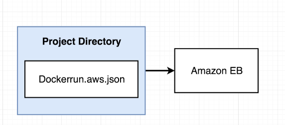

**Complex Kubernetes Project**
--

Previous React app design: - Dev and Prod
-
basic design of the system.

Testing flow using travis to build multi container service and push the images to docker hub.

Aws Deployment flow on Elastic Beanstalk.

Upgraded design using Kubernetes: - Pure Prod
--

